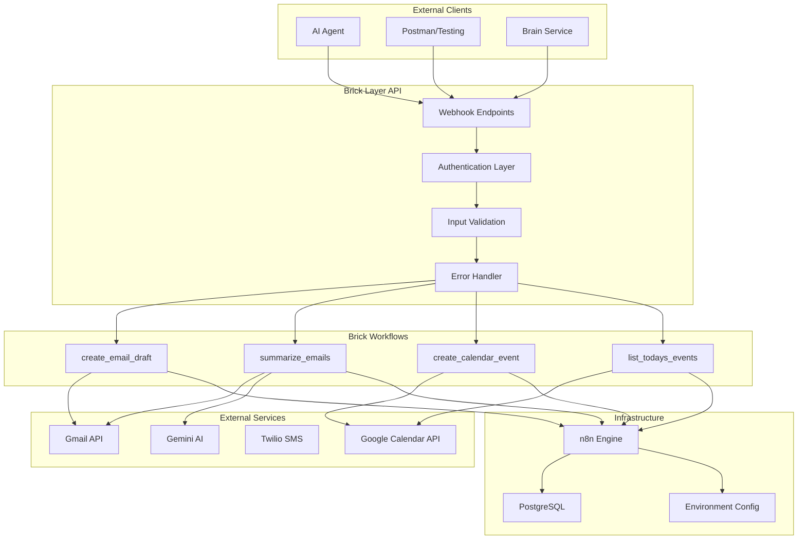
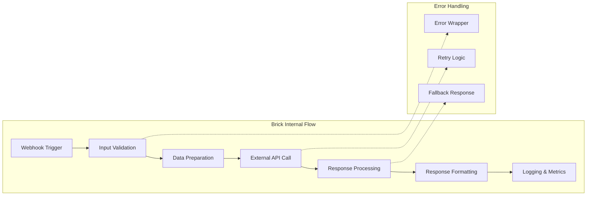

# Design Document

## Overview

The Pulse AI Assistant Brick Layer v0.2 transforms the existing monolithic n8n workflows into a modular, reusable library of "bricks" - standardized sub-workflows that can be called independently via HTTP endpoints. This design builds upon the existing dockerized infrastructure with Gmail OAuth2, Google Calendar API, and Twilio SMS integration, adding a robust API layer with authentication, validation, and comprehensive error handling.

The system follows a microservices-inspired architecture where each brick is a self-contained workflow unit that can be composed into larger automation flows. This enables AI agents to interact with individual capabilities rather than triggering entire complex workflows.

## Architecture

### High-Level Architecture



### Brick Architecture Pattern

Each brick follows a standardized internal structure:



## Components and Interfaces

### 1. Webhook Endpoint Layer

**Location**: n8n Webhook Trigger nodes  
**Purpose**: Expose HTTP endpoints for each brick  
**Pattern**: `POST /webhook-brick/<brick_name>`

```typescript
interface WebhookEndpoint {
  path: string;           // "/webhook-brick/create_email_draft"
  method: "POST";
  authentication: "X-Pulse-Key";
  contentType: "application/json";
}
```

### 2. Authentication Middleware

**Implementation**: Function node in each brick workflow  
**Purpose**: Validate API key from request headers

```typescript
interface AuthenticationHandler {
  validateKey(request: Request): AuthResult;
  extractKey(headers: Headers): string | null;
  logAuthAttempt(result: AuthResult): void;
}

interface AuthResult {
  valid: boolean;
  error?: string;
  keyHash?: string; // For logging (hashed)
}
```

### 3. Input Validation Layer

**Implementation**: Shared validation utility + Function nodes  
**Purpose**: Validate and sanitize input parameters using JSON Schema

```typescript
interface ValidationSchema {
  type: "object";
  properties: Record<string, SchemaProperty>;
  required: string[];
  additionalProperties: false;
}

interface BrickValidator {
  validateInput(input: any, schema: ValidationSchema): ValidationResult;
  sanitizeInput(input: any): any;
  generateErrorResponse(errors: ValidationError[]): ErrorResponse;
}
```

### 4. Brick Response Handler

**Implementation**: Shared utility library  
**Purpose**: Standardize response format across all bricks

```typescript
interface BrickResponse<T = any> {
  ok: boolean;
  data?: T;
  error?: string;
  timestamp: string;
  brick: string;
  requestId?: string;
}

interface BrickResponseHandler {
  success<T>(data: T, brick: string): BrickResponse<T>;
  error(error: string, brick: string): BrickResponse;
  wrap<T>(operation: () => Promise<T>, brick: string): Promise<BrickResponse<T>>;
}
```

### 5. Individual Brick Interfaces

#### create_email_draft Brick
```typescript
interface CreateEmailDraftInput {
  to: string;      // Email address
  subject: string; // Email subject
  body: string;    // Email body content
}

interface CreateEmailDraftOutput {
  draftId: string; // Gmail draft ID
}
```

#### summarize_emails Brick
```typescript
interface SummarizeEmailsInput {
  sinceISO: string; // ISO 8601 timestamp
}

interface SummarizeEmailsOutput {
  summary: string; // AI-generated summary
  emailCount: number;
  timeRange: {
    from: string;
    to: string;
  };
}
```

#### create_calendar_event Brick
```typescript
interface CreateCalendarEventInput {
  title: string;
  startISO: string;    // ISO 8601 timestamp
  endISO: string;      // ISO 8601 timestamp
  guests?: string[];   // Email addresses
  description?: string;
  location?: string;
}

interface CreateCalendarEventOutput {
  eventId: string; // Google Calendar event ID
  htmlLink: string; // Calendar event URL
}
```

#### list_todays_events Brick
```typescript
interface ListTodaysEventsInput {
  // No input parameters
}

interface ListTodaysEventsOutput {
  events: CalendarEvent[];
}

interface CalendarEvent {
  title: string;
  start: string;    // ISO 8601 timestamp
  end: string;      // ISO 8601 timestamp
  location?: string;
  attendees?: string[];
}
```

## Data Models

### 1. Brick Configuration Model

```typescript
interface BrickConfig {
  name: string;
  version: string;
  description: string;
  endpoint: string;
  inputSchema: ValidationSchema;
  outputSchema: ValidationSchema;
  dependencies: string[];
  rateLimit?: {
    requests: number;
    window: number; // seconds
  };
}
```

### 2. Request Context Model

```typescript
interface RequestContext {
  requestId: string;
  timestamp: string;
  brick: string;
  clientIP?: string;
  userAgent?: string;
  authKeyHash: string;
}
```

### 3. Audit Log Model

```typescript
interface AuditLogEntry {
  timestamp: string;
  requestId: string;
  brick: string;
  action: string;
  success: boolean;
  duration: number;
  error?: string;
  inputHash: string; // Hashed input for privacy
  clientInfo: {
    ip?: string;
    userAgent?: string;
  };
}
```

## Error Handling

### Error Classification

1. **Authentication Errors** (401)
   - Missing API key
   - Invalid API key
   - Expired key

2. **Validation Errors** (400)
   - Missing required fields
   - Invalid data types
   - Schema validation failures

3. **External API Errors** (502/503)
   - Gmail API failures
   - Google Calendar API failures
   - Gemini API failures
   - Rate limiting from external services

4. **Internal Errors** (500)
   - Database connection failures
   - Workflow execution errors
   - Unexpected exceptions

### Error Response Format

```typescript
interface ErrorResponse {
  ok: false;
  error: string;
  code: string;
  details?: any;
  timestamp: string;
  brick: string;
  requestId?: string;
}
```

### Retry Strategy

```typescript
interface RetryConfig {
  maxAttempts: number;
  baseDelay: number;
  maxDelay: number;
  backoffMultiplier: number;
  retryableErrors: string[];
}

const DEFAULT_RETRY_CONFIG: RetryConfig = {
  maxAttempts: 3,
  baseDelay: 1000,
  maxDelay: 30000,
  backoffMultiplier: 2,
  retryableErrors: ['ECONNRESET', 'ETIMEDOUT', 'RATE_LIMITED']
};
```

## Testing Strategy

### 1. Unit Testing

**Framework**: Jest  
**Scope**: Individual brick logic, validation functions, response handlers

```typescript
describe('create_email_draft brick', () => {
  test('validates required input fields', async () => {
    const input = { subject: 'Test', body: 'Test body' }; // missing 'to'
    const result = await validateBrickInput(input, CREATE_EMAIL_DRAFT_SCHEMA);
    expect(result.valid).toBe(false);
    expect(result.errors).toContain('to is required');
  });

  test('creates draft successfully with valid input', async () => {
    const input = { to: 'test@example.com', subject: 'Test', body: 'Test body' };
    const result = await callBrick('create_email_draft', input);
    expect(result.ok).toBe(true);
    expect(result.data.draftId).toBeDefined();
  });
});
```

### 2. Integration Testing

**Scope**: End-to-end brick functionality with external APIs

```typescript
describe('Integration Tests', () => {
  test('create_email_draft integrates with Gmail API', async () => {
    const response = await fetch('/webhook-brick/create_email_draft', {
      method: 'POST',
      headers: {
        'Content-Type': 'application/json',
        'X-Pulse-Key': process.env.BRICK_AUTH_KEY
      },
      body: JSON.stringify({
        to: 'test@example.com',
        subject: 'Integration Test',
        body: 'This is a test email draft'
      })
    });
    
    expect(response.status).toBe(200);
    const result = await response.json();
    expect(result.ok).toBe(true);
    expect(result.data.draftId).toMatch(/^r-?\d+$/);
  });
});
```

### 3. Load Testing

**Tool**: Custom Node.js script  
**Scope**: Rate limiting, concurrent request handling

```typescript
interface LoadTestConfig {
  concurrent: number;
  duration: number;
  rampUp: number;
  endpoints: string[];
}

async function runLoadTest(config: LoadTestConfig): Promise<LoadTestResults> {
  // Implementation for load testing bricks
}
```

### 4. Security Testing

**Scope**: Authentication, input validation, data sanitization

```typescript
describe('Security Tests', () => {
  test('rejects requests without API key', async () => {
    const response = await fetch('/webhook-brick/create_email_draft', {
      method: 'POST',
      body: JSON.stringify({ to: 'test@example.com', subject: 'Test', body: 'Test' })
    });
    expect(response.status).toBe(401);
  });

  test('sanitizes sensitive data in logs', () => {
    const input = { to: 'user@example.com', subject: 'Secret: password123', body: 'API key: abc123' };
    const sanitized = sanitizeForLogging(input);
    expect(sanitized.subject).not.toContain('password123');
    expect(sanitized.body).not.toContain('abc123');
  });
});
```

## Implementation Details

### 1. Brick Template Structure

Each brick follows this n8n workflow structure:

1. **Webhook Trigger Node**
   - HTTP endpoint configuration
   - POST method only
   - JSON content type

2. **Authentication Function Node**
   - Extract X-Pulse-Key header
   - Validate against BRICK_AUTH_KEY
   - Return 401 on failure

3. **Input Validation Function Node**
   - JSON Schema validation
   - Input sanitization
   - Return 400 on validation failure

4. **Business Logic Nodes**
   - API calls to external services
   - Data processing
   - Response preparation

5. **Error Handling Function Node**
   - Catch and format errors
   - Standardized error responses
   - Logging and monitoring

6. **Response Function Node**
   - Format successful responses
   - Add metadata (timestamp, requestId)
   - Return JSON response

### 2. Shared Utilities

**File**: `flows/libs/brickUtils.js`

```javascript
// Input validation using AJV
const Ajv = require('ajv');
const ajv = new Ajv();

function validateBrickInput(input, schema) {
  const validate = ajv.compile(schema);
  const valid = validate(input);
  return {
    valid,
    errors: validate.errors || []
  };
}

// Response formatting
function createSuccessResponse(data, brick) {
  return {
    ok: true,
    data,
    timestamp: new Date().toISOString(),
    brick,
    requestId: generateRequestId()
  };
}

function createErrorResponse(error, brick, code = 'INTERNAL_ERROR') {
  return {
    ok: false,
    error: error.message || error,
    code,
    timestamp: new Date().toISOString(),
    brick,
    requestId: generateRequestId()
  };
}
```

### 3. Environment Configuration

**New Environment Variables**:

```bash
# Brick Layer Configuration
BRICK_AUTH_KEY=your-secure-api-key-here
BRICK_RATE_LIMIT_REQUESTS=100
BRICK_RATE_LIMIT_WINDOW=3600

# Google Calendar API
GOOGLE_CALENDAR_ID=primary
```

### 4. Docker Configuration Updates

**docker-compose.yml additions**:

```yaml
n8n:
  environment:
    # Existing environment variables...
    
    # Brick Layer Configuration
    BRICK_AUTH_KEY: ${BRICK_AUTH_KEY}
    BRICK_RATE_LIMIT_REQUESTS: ${BRICK_RATE_LIMIT_REQUESTS:-100}
    BRICK_RATE_LIMIT_WINDOW: ${BRICK_RATE_LIMIT_WINDOW:-3600}
    
    # Google Calendar API
    GOOGLE_CALENDAR_ID: ${GOOGLE_CALENDAR_ID:-primary}
  
  # Expose additional port for brick endpoints if needed
  ports:
    - '5678:5678'  # Existing n8n port
```

This design provides a robust, scalable foundation for the brick layer system while maintaining compatibility with the existing infrastructure and following security best practices.