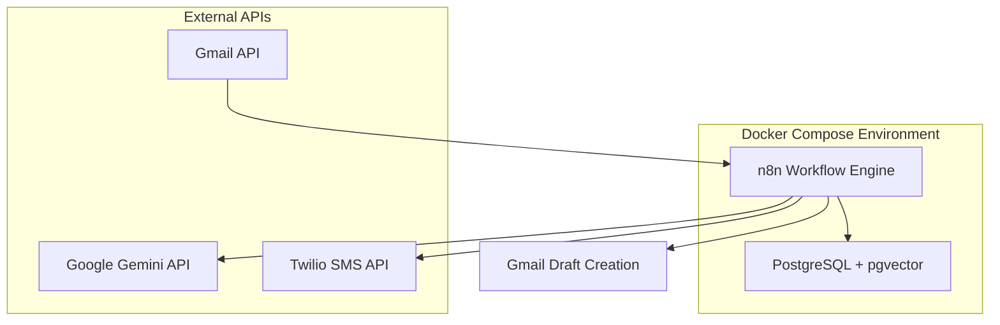

# Design Document

## Overview

Pulse is architected as a containerized microservices application using Docker Compose to orchestrate a PostgreSQL database with pgvector extension and n8n workflow automation platform. The system implements a privacy-first approach by processing all data locally while leveraging external APIs (Gmail, Gemini, Twilio) through secure OAuth2 and API key authentication. The core workflow follows an event-driven pattern: Gmail trigger → Gemini processing → Draft creation → SMS notification.

## Architecture

### System Components



### Data Flow

1. **Email Ingestion**: n8n Gmail trigger monitors inbox using OAuth2 authentication
2. **Content Processing**: Email content extracted and sent to Gemini API for response generation
3. **Draft Creation**: Generated response formatted and created as Gmail draft
4. **Notification**: SMS sent via Twilio with draft summary
5. **Persistence**: Workflow state and logs stored in PostgreSQL

### Security Model

- **Authentication**: OAuth2 for Gmail, API keys for Gemini/Twilio stored as environment variables
- **Data Privacy**: No email content persisted beyond workflow execution
- **Network Security**: All external API calls use HTTPS
- **Local Processing**: Core logic runs in isolated Docker containers
- **Container Security**: n8n runs as non-root user (UID 1000)
- **Production Hardening**: Remote credential editing disabled, auto-TLS via Caddy + Let's Encrypt for cloud deployment
- **SMS Rate Limiting**: Daily SMS cap and per-run limits to prevent abuse

## Components and Interfaces

### n8n Workflow Engine

**Purpose**: Orchestrates the entire email processing pipeline
**Configuration**:

- Basic authentication for web interface
- PostgreSQL backend for workflow state
- Custom workflow JSON for Gmail→Gemini→SMS flow

**Key Nodes**:

- Gmail Trigger: Monitors inbox for new messages
- HTTP Request: Calls Gemini API with email content
- Set Node: Extracts and formats response text
- Gmail Node: Creates draft response
- Twilio Node: Sends SMS notification

### PostgreSQL Database

**Purpose**: Stores n8n workflow state, execution history, and credentials
**Configuration**:

- Standard PostgreSQL without pgvector (removed for MVP simplicity - will be added in Sprint #2 for semantic search features)
- Persistent volume for data retention
- Connection pooling for n8n

**Schema**: Managed automatically by n8n, includes:

- Workflow definitions
- Execution logs
- Credential storage (encrypted)

**pgvector Decision**: Removed from MVP to reduce complexity. Will be added in Sprint #2 when implementing semantic email search and response similarity features.

### External API Integrations

#### Gmail API Integration

- **Authentication**: OAuth2 with read/write permissions
- **Endpoints**:
  - Watch for new messages
  - Create draft responses
  - Access message content and metadata
- **Rate Limits**: 1 billion quota units per day (sufficient for MVP)

#### Google Gemini API Integration

- **Authentication**: API key via HTTP header
- **Endpoint**: `https://generativelanguage.googleapis.com/v1beta/models/gemini-pro:generateContent`
- **Request Format**: JSON with email content in prompt
- **Response Processing**: Extract generated text from response structure
- **Performance**: Target <3s response time (95th percentile)
- **Rate Limits**: Free tier 1M tokens/day, implement token counting and daily limit tracking
- **Content Processing**: Convert HTML emails to plain text, skip large attachments (>1MB)

#### Twilio SMS Integration

- **Authentication**: Account SID and Auth Token
- **Endpoint**: Messages API for SMS sending
- **Message Format**: "Draft ready: {subject}" with sender info
- **Rate Limiting**: Daily SMS cap (SMS_DAILY_LIMIT env var) and max 3 SMS per workflow run
- **Attachment Handling**: Include "Attachments omitted" note when large files are skipped

## Data Models

### Email Processing Context

```typescript
interface EmailContext {
  messageId: string;
  subject: string;
  sender: string;
  body: string;
  timestamp: Date;
  threadId: string;
}
```

### Gemini API Request

```typescript
interface GeminiRequest {
  contents: [
    {
      parts: [
        {
          text: string; // Email content + prompt
        },
      ];
    },
  ];
}
```

### SMS Notification

```typescript
interface SMSNotification {
  to: string; // User's phone number
  from: string; // Twilio number
  body: string; // "Draft ready: {subject}"
}
```

## Error Handling

### API Failure Scenarios

1. **Gmail API Errors**:
   - Rate limiting: Implement exponential backoff
   - Authentication failure: Log error, require credential refresh
   - Network timeout: Retry with increased timeout

2. **Gemini API Errors**:
   - Rate limiting: Queue requests with delay
   - Invalid response: Log error, create manual draft placeholder
   - API key issues: Alert via logs, continue monitoring

3. **Twilio SMS Errors**:
   - Delivery failure: Retry once, then log failure
   - Invalid phone number: Log error, continue workflow
   - Account issues: Log error, don't block draft creation

### System Recovery

- **Database Connection Loss**: Automatic reconnection with exponential backoff
- **Container Restart**: Workflows resume from last checkpoint
- **Credential Expiry**: Clear error messages in logs for manual intervention

## Testing Strategy

### Unit Testing Approach

- **n8n Workflow Testing**: Use n8n's built-in test execution with mock data
- **API Integration Testing**: Mock external API responses for consistent testing
- **Database Testing**: Use test database with sample workflow data

### Integration Testing

- **End-to-End Flow**: Test complete Gmail→Gemini→Draft→SMS pipeline
- **Error Scenarios**: Simulate API failures and verify graceful handling
- **Performance Testing**: Verify response times under normal load

### Manual Testing Checklist

1. Send test email to monitored Gmail account
2. Verify Gemini generates appropriate response
3. Confirm draft appears in Gmail with correct content
4. Validate SMS notification delivery and content
5. Test error scenarios (invalid API keys, network issues)

### Monitoring and Observability

- **n8n Execution Logs**: Track workflow success/failure rates
- **API Response Times**: Monitor external service performance
- **Error Alerting**: Log critical failures for immediate attention
- **Health Checks**: /healthz endpoint returning HTTP 200 for n8n and PostgreSQL status
- **Metrics**: Enable n8n /metrics endpoint for Prometheus integration
